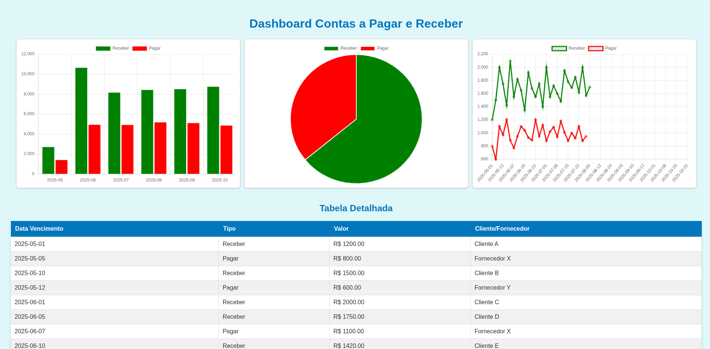

# 💰 Dashboard de Contas a Pagar e Receber

Este projeto é um painel financeiro interativo que exibe visualmente dados de contas a pagar e a receber por meio de gráficos e uma tabela detalhada. Desenvolvido em PHP com dados em JSON, este sistema é ideal para controle e análise de fluxo de caixa mensal.

## 📊 Funcionalidades

- Gráfico de barras: comparativo mensal entre contas a pagar e receber
- Gráfico de pizza: proporção total entre os valores a pagar e a receber
- Gráfico de linha: tendência dos valores ao longo do tempo
- Tabela detalhada: listagem com data, tipo, valor e cliente/fornecedor

## 🧩 Tecnologias Utilizadas

- **PHP**: Backend para manipulação de dados
- **JSON**: Armazenamento de dados financeiros
- **HTML/CSS**: Estrutura e estilo do dashboard
- **JavaScript** (Chart.js): Renderização dos gráficos

## 🗂 Estrutura de Arquivos

| Arquivo          | Descrição |
|------------------|-----------|
| `index.php`      | Página principal do dashboard |
| `data.php`       | Script para fornecer dados em JSON ao frontend |
| `db.php`         | Conexão com banco de dados (caso desejado no futuro) |
| `dados.json`     | Fonte de dados (contas a pagar/receber) |
| `script.js`      | Lógica de gráficos com Chart.js |
| `style.css`      | Estilização da interface |
| `imagem.png`     | Captura de tela do dashboard |
| `financeiro.sql` | Script opcional para criação de tabela no banco de dados |

## 📷 Exemplo do Dashboard



## 🚀 Como Rodar o Projeto

1. Clone este repositório:
   ```bash
   git clone https://github.com/VitorGirottto/Dashboard.git

2. Crie uma tabela em seu banco de dados, com o nome `financeiro` e execute o script no financeiro.sql, para criação da tabela e de algumas informações teste se desejar.

3. Coloque as informações de conexão com seu banco de dados que está no arquivo `db.php`.
